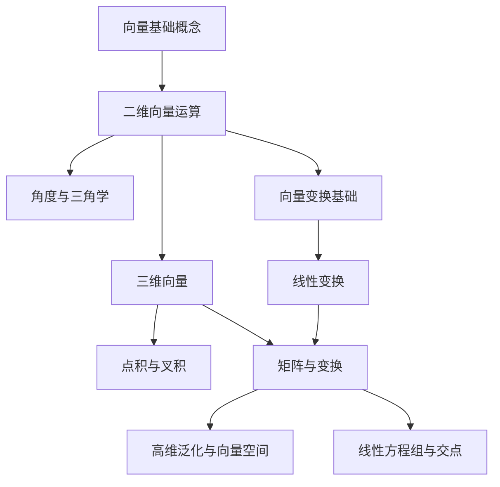

---
tags:
  - 数学
  - 线性代数
  - 目录
date: 2026-09-15
---

# 线性代数笔记 — 目录

本系列笔记基于《程序员数学：用 Python 学透线性代数和微积分》第 1–7 章，结合 Jupyter Notebook 实操整理而成。

## 笔记结构

1. [01-向量基础概念](#/viewNotes?id=A-009-%E7%BA%BF%E6%80%A7%E4%BB%A3%E6%95%B0%2F01-%E5%90%91%E9%87%8F%E5%9F%BA%E7%A1%80%E6%A6%82%E5%BF%B5) — 什么是向量、二维向量的表示、坐标系
2. [02-二维向量运算](#/viewNotes?id=A-009-%E7%BA%BF%E6%80%A7%E4%BB%A3%E6%95%B0%2F02-%E4%BA%8C%E7%BB%B4%E5%90%91%E9%87%8F%E8%BF%90%E7%AE%97) — 加法、标量乘法、减法、位移、距离、长度
3. [03-角度与三角学](#/viewNotes?id=A-009-%E7%BA%BF%E6%80%A7%E4%BB%A3%E6%95%B0%2F03-%E8%A7%92%E5%BA%A6%E4%B8%8E%E4%B8%89%E8%A7%92%E5%AD%A6) — 正弦/余弦/正切、弧度、极坐标与笛卡尔坐标转换
4. [04-向量变换基础](#/viewNotes?id=A-009-%E7%BA%BF%E6%80%A7%E4%BB%A3%E6%95%B0%2F04-%E5%90%91%E9%87%8F%E5%8F%98%E6%8D%A2%E5%9F%BA%E7%A1%80) — 旋转、平移、缩放、函数组合与矩阵
5. [05-三维向量](#/viewNotes?id=A-009-%E7%BA%BF%E6%80%A7%E4%BB%A3%E6%95%B0%2F05-%E4%B8%89%E7%BB%B4%E5%90%91%E9%87%8F) — 三维向量运算、点积、向量积（叉积）、三维渲染
6. [06-线性变换](#/viewNotes?id=A-009-%E7%BA%BF%E6%80%A7%E4%BB%A3%E6%95%B0%2F06-%E7%BA%BF%E6%80%A7%E5%8F%98%E6%8D%A2) — 线性变换的定义与性质、标准基、线性组合
7. [07-矩阵与变换](#/viewNotes?id=A-009-%E7%BA%BF%E6%80%A7%E4%BB%A3%E6%95%B0%2F07-%E7%9F%A9%E9%98%B5%E4%B8%8E%E5%8F%98%E6%8D%A2) — 矩阵表示变换、矩阵乘法、单位矩阵、齐次坐标平移
8. [08-高维泛化与向量空间](#/viewNotes?id=A-009-%E7%BA%BF%E6%80%A7%E4%BB%A3%E6%95%B0%2F08-%E9%AB%98%E7%BB%B4%E6%B3%9B%E5%8C%96%E4%B8%8E%E5%90%91%E9%87%8F%E7%A9%BA%E9%97%B4) — 向量空间公理、泛化向量、抽象基类实现
9. [09-习题精选](#/viewNotes?id=A-009-%E7%BA%BF%E6%80%A7%E4%BB%A3%E6%95%B0%2F09-%E4%B9%A0%E9%A2%98%E7%B2%BE%E9%80%89) — 各章节关键习题与解答
10. [10-线性方程组与交点](#/viewNotes?id=A-009-%E7%BA%BF%E6%80%A7%E4%BB%A3%E6%95%B0%2F10-%E7%BA%BF%E6%80%A7%E6%96%B9%E7%A8%8B%E7%BB%84%E4%B8%8E%E4%BA%A4%E7%82%B9) — 解线性方程组、直线交点、碰撞检测

## 核心知识脉络

## 关键公式速查

| 概念 | 公式 |
|------|------|
| 向量加法 | $(x_1,y_1)+(x_2,y_2)=(x_1+x_2,y_1+y_2)$ |
| 标量乘法 | $s \cdot (x,y) = (sx, sy)$ |
| 向量长度 | $\|(x,y)\| = \sqrt{x^2 + y^2}$ |
| 点积 | $\vec{u} \cdot \vec{v} = u_x v_x + u_y v_y + u_z v_z$ |
| 点积与角度 | $\vec{u} \cdot \vec{v} = \|\vec{u}\| \|\vec{v}\| \cos\theta$ |
| 叉积 | $\vec{u} \times \vec{v} = (u_y v_z - u_z v_y, u_z v_x - u_x v_z, u_x v_y - u_y v_x)$ |
| 线性变换 | $T(u+v) = T(u) + T(v),\quad T(sv) = sT(v)$ |
| 线性方程组 | $M\mathbf{x}=\mathbf{c}$ |

<!-- complete-exercise-library -->

## 完整习题库

- [逐题练习库（193 题）](#/viewNotes?id=A-009-%E7%BA%BF%E6%80%A7%E4%BB%A3%E6%95%B0%2F%E4%B9%A0%E9%A2%98%2F00-%E4%B9%A0%E9%A2%98%E6%80%BB%E8%A7%88)：按每题一篇的方式完成、验证和复盘。

## 相关目录

- `A-010-微积分/00-目录` — 第 8–16 章微积分与应用笔记
- `A-010-微积分/06-傅里叶级数与内积` — 函数空间中的内积与线性组合

## 来源

- 书籍：《程序员数学：用 Python 学透线性代数和微积分》
- 代码仓库：`E:\CodeFile\python\mathematics-for-programmers\Math-for-Programmers-master`
